# SQL_Final_Project - Insurance Portfolio Analysis
## Layihənin məqsədi
Bu layihənin məqsədi sığorta şirkətinin müştəri portfelini, ödənən zərərləri və agent performansını SQL vasitəsilə analiz etmək, nəticələri Excel-də vizuallaşdırmaq və PowerPoint-də təqdim etməkdir.  

**Əsas məqsəd:** sığorta gəlirliliyini, riskləri və satış performansını qiymətləndirmək.

## Dataset
Layihə üçün istifadə olunan dataset burada mövcuddur:  
[Download Insurance Dataset](Datasets)

## İstifadə olunan cədvəllər
1. **CUSTOMERS**
   - customer_id: Müştəri ID-si
   - full_name: Müştərinin adı
   - gender: Cins (Male/Female)
   - age: Yaş
   - city: Şəhər
   - vehicle_type: Maşın növü (Car, Truck, Motorcycle və s.)

2. **AGENTS**
   - agent_id: Agentin ID-si
   - agent_name: Agentin adı
   - branch: Filial adı
   - hire_date: İşə qəbul tarixi
   - region: Region (Baku, Ganja və s.)

3. **POLICIES**
   - policy_id: Sığorta müqaviləsinin ID-si
   - customer_id: Müştəri ID-si
   - agent_id: Agent ID-si
   - policy_type: Sığorta növü
   - start_date / end_date: Müqavilənin müddəti
   - premium_amount: Sığorta haqqı (USD)
   - coverage_amount: Əhatə məbləği (USD)
   - status: Status (Active, Expired, Cancelled)

4. **CLAIMS**
   - claim_id: Zərər iddiası ID-si
   - policy_id: Müqavilə ID-si
   - claim_date: Zərərin baş verdiyi tarix
   - claim_amount: Ödənilən zərər məbləği
   - claim_reason: Zərərin səbəbi
   - status: Status (Approved, Rejected, Pending)

5. **PAYMENTS**
   - payment_id: Ödəniş ID-si
   - policy_id: Müqavilə ID-si
   - payment_date: Ödəniş tarixi
   - amount: Ödənilən məbləğ
   - payment_method: Ödəniş üsulu (Card, Cash, Online)

## Ümumi göstəricilər
**Sual 1.**	Ümumi sığorta haqqı (premium) və ödənmiş zərər (claim) məbləğini hesabla.

*Istifadə etdiyim script*:
[Sql-task1](Script/Task_1.sql)

*Nəticə*:
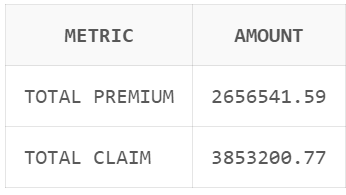

**Sual 2.**	İl üzrə ümumi gəlir (premium – claims) trendini tap.

*Istifadə etdiyim script*:
[Sql-task2](Script/Task_2.sql)

*Nəticə*:
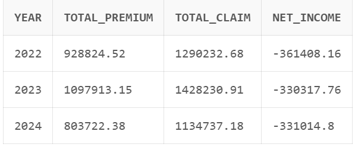

**Sual 3.**	Aktiv, başa çatmış və ləğv edilmiş müqavilələrin sayını çıxar.

*Istifadə etdiyim script*:
[Sql-task3](Script/Task_3.sql)

*Nəticə*:
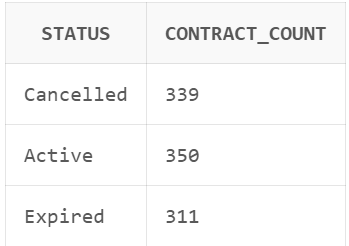

**Sual 4.**	Ən çox sığorta müqaviləsi bağlayan 5 agenti tap.

*Istifadə etdiyim script*:
[Sql-task4](Script/Task_4.sql)

*Nəticə*:
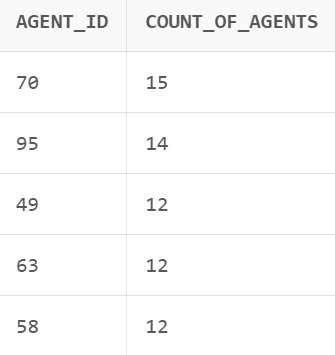

**Sual 5.**	Ən çox gəlir gətirən 3 filial (branch) hansılardır?

*Istifadə etdiyim script*:
[Sql-task5](Script/Task_5.sql)

*Nəticə*:
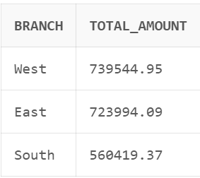

## Müştəri və risk analizi
**Sual 6.**	Şəhərlər üzrə müştəri sayı və orta sığorta haqqı.

*Istifadə etdiyim script*:
[Sql-task6](Script/Task_6.sql)

*Nəticə*:
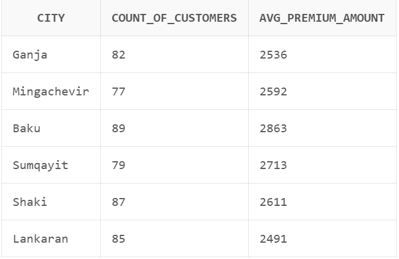

**Sual 7.**	Müştəri yaş qruplarına görə ortalama zərər məbləği.

*Istifadə etdiyim script*:
[Sql-task7](Script/Task_7.sql)

*Nəticə*:
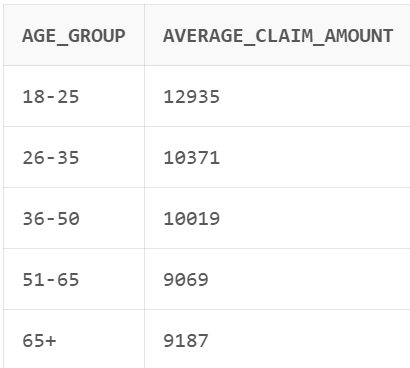

**Sual 8.**	Ən çox zərərə səbəb olan hadisə növləri (claim_reason).

*Istifadə etdiyim script*:
[Sql-task8](Script/Task_8.sql)

*Nəticə*:
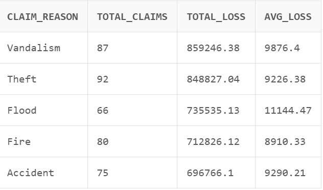

**Sual 9.**	Ən riskli sığorta növü hansıdır (claim/policy nisbətinə görə)?

*Istifadə etdiyim script*:
[Sql-task9](Script/Task_9.sql)

*Nəticə*:
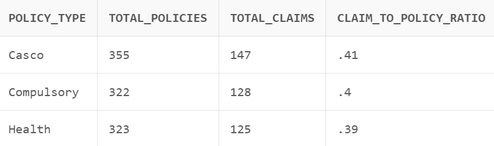

**Sual 10.** Aktiv sığortaların orta əhatə məbləği (coverage_amount) nə qədərdir?

*Istifadə etdiyim script*:
[Sql-task10](Script/Task_10.sql)

*Nəticə*:
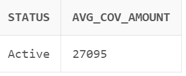

## Agent performansı
**Sual 11.** Hər agent üzrə ümumi satış (premium) və ödənmiş zərər (claim) məbləği.

*Istifadə etdiyim script*:
[Sql-task11](Script/Task_11.sql)

**Sual 12.** Agentin müştəri sayı və orta sığorta məbləği.

*Istifadə etdiyim script*:
[Sql-task12](Script/Task_12.sql)

**Sual 13.** Regionlar üzrə ümumi gəlirlilik faizi ( (premium - claims)/premium ).

*Istifadə etdiyim script*:
[Sql-task13](Script/Task_13.sql)

*Nəticə*:
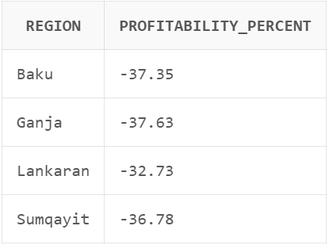

## Ödənişlər
**Sual 14.** Ödəniş üsullarının (payment_method) payı və sayı.

*Istifadə etdiyim script*:
[Sql-task14](Script/Task_14.sql)

*Nəticə*:
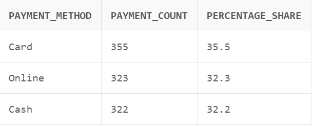

**Sual 15.** Gecikmiş ödənişlərin (start_date < payment_date) faizi.

*Istifadə etdiyim script*:
[Sql-task15](Script/Task_15.sql)

*Nəticə*:
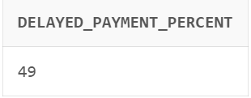

**Sual 16.** Müştəri başına orta ödəniş məbləğini tap.

*Istifadə etdiyim script*:
[Sql-task16](/workspaces/SQL_Final_Project/Script/Task_16.sql)

## Bonus
**Bonus 1.** Hər agentin gəlirlilik faizi (profitability) nə qədərdir?

*Istifadə etdiyim script*:
[Sql-task_Bonus_1](Script/Task_Bonus_1.sql)

**Sual 18.** Müştəri səviyyəsində “claim ratio” (claims/premiums) hesabla.

*Istifadə etdiyim script*:
[Sql-task_Bonus_2](Script/Task_Bonus_2.sql)

